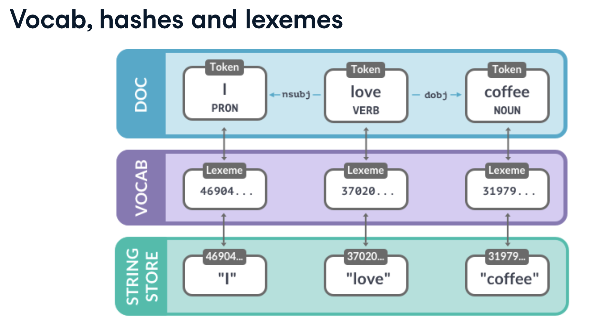

# Large-scale data analysis with spaCy

## Shared vocab and string store
- ```Vocab```: stores data shared across multiple documents
	- includes words
	- also labels schemes for tags and entities
- To save memory, spaCy encodes all strings to **hash values**
- Strings are only stored once in the ```StringStore``` via ```nlp.vocab.strings```
- String store: **lookup table** in both directions
```python
coffee_hash = nlp.vocab.strings['coffee']
coffee_string = nlp.vocab.strings[coffee_hash]
```
- Hashes can't be reversed - that's why we need to provide the shared vocab
```python
# Raises an error if we haven't seen the string before
string = nlp.vocab.strings[3197928453018144401]
```
- Look up the string and hash in ```nlp.vocab.strings```
```python
doc = nlp("I love coffee")
print('hash value:', nlp.vocab.strings['coffee'])
print('string value:', nlp.vocab.strings[3197928453018144401]
```
```shell
hash value: 3197928453018144401
string value: coffee
```
- The ```doc``` also exposes the vocab and strings
```python
doc = nlp("I love coffee")
print('hash value:', doc.vocab.strings['coffee'])
```
```shell
hash value: 3197928453018144401
```

## Lexemes: entries in the vocabulary
- A ```Lexeme``` object is an entry in the vocabulary
```python
doc = nlp("I love coffee")
lexeme = nlp.vocab['coffee']
# print the lexical attributes
print(lexeme.text, lexeme.orth, lexeme.is_alpha)
```
```shell
coffee 3197928453018144401 True
```
- Contains the **context-independent** information about a word
	- Word text: ```lexeme.text``` and ```lexeme.orth``` (the hash)
	- Lexical attributes like ```lexeme.is_alpha```
	- **Not** context-dependent part-of-speech tags, dependencies or entity labels

In the following example, the doc contains words in context ("I", "love", "coffee") with their part-of-speech tags and dependencies. Each token refers to a lexeme, which knows the word's hash ID. To get the string representation of the word, spaCy looks up the hash in the string store.


